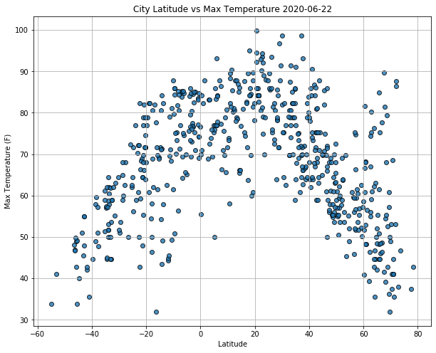
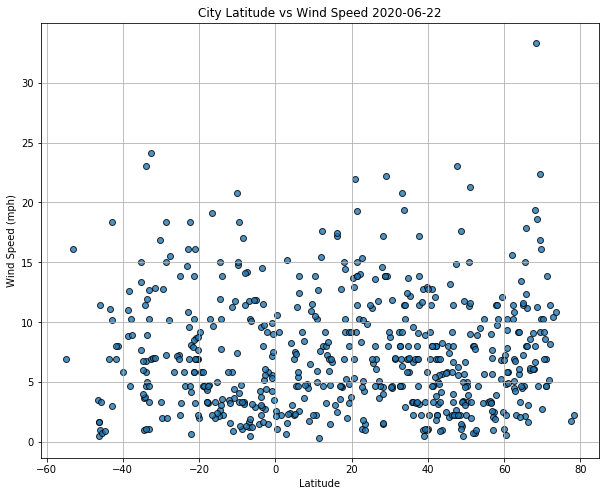
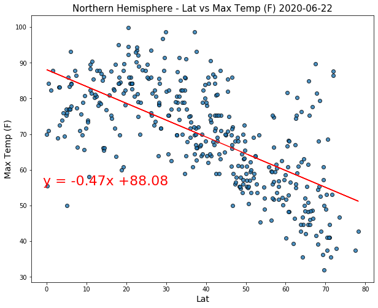
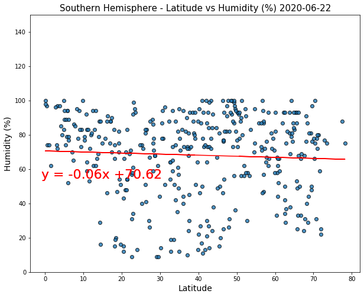
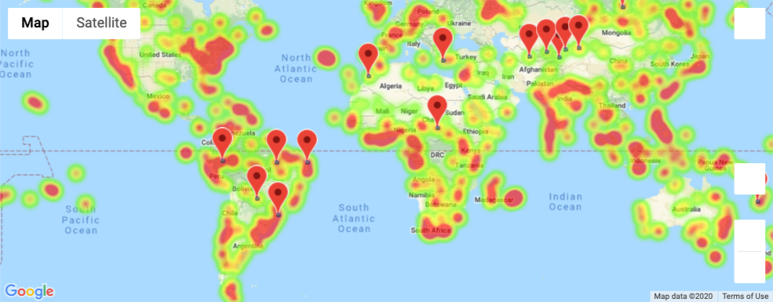

# Python API Challenge
## What's the Weather Like?

## Background

This project has two parts one used an API request, and Python script to visualize the weather date of 500+ cities across the world of varying distance from the equator, and sourced under [**WeatherPy folder**](WeatherPy/). To accomplish this, I utilized a [**simple Python library**](https://pypi.python.org/pypi/citipy), the [**OpenWeatherMap API**](https://openweathermap.org/api), and created a representative model of weather across world cities. The cities dataset found in [**output_data folder**](WeatherPy/output_data/cities.csv) which includes the following columns `City_ID`,`City`,`Cloudines`,`Country`,`Date`, `Humidity`,`Lat`,`Lng`,`Max`,`Temp`,`Wind Speed`. The data analyzed, and displayed on [**WeatherPy jupyter notebook**](WeatherPy/WeatherPy.ipynb), and the results are exported in CSV format [**city_weather_data.csv**](WeatherPy/output_data/city_weather_data.csv), and the regression plots in the [**output folder**](WeatherPy/output_data/).

The other project [**VacationPy**](VacationPy/) is used the output data from the previous task [**city_weather_data.csv**](WeatherPy/output_data/city_weather_data.csv), and investigate the data to plan for future vacations, and to select hotels. For this part of the analysis the a jupyter-gmaps, and the Google Places were used, and the results are displayed in [**VacationPy jupyter notebook**](VacationPy/VacationPy.ipynb). The analysis covers humidity heatmap in the cities that sourced from the weather data, and spot the hotels on top of the humidity heatmap. You can look at the images in the output folder for both [**the heatmap**](VacationPy/output_data/Heatmap.png) and [**the hotel heatmap**](VacationPy/output_data/hotel.png,) images.

For both parts to communicate the analysis report the following links are created in Jupyter viewer: 

WeatherPy Analysis: [WeatherPy Analysis](https://nbviewer.ipython.org/github/ermiasgelaye/python-api-challenge/blob/master/WeatherPy/WeatherPy.ipynb) 

VacationPy Analysis: [VacationPy Analysis](https://nbviewer.ipython.org/github/ermiasgelaye/python-api-challenge/blob/master/VacationPy/.ipynb_checkpoints/VacationPy-checkpoint.ipynb) 

## <a name="api_keys"></a> API Keys


To run locally the python files for both [WeatherPy](WeatherPy/WeatherPy.ipynb), and [**VacationPy**](VacationPyy/VacationPy.ipynb) projects you need to obtain API keys. For part one, you will need to obtain an API key for the OpenWeatherMap API, which can be obtained [here](https://home.openweathermap.org/api_keys). After you have the OpenWeatherMap API key, in the **WeatherPy** folder, [**config.py**](WeatherPy/api_keys.py) file add the API key there, and it looks as follows:

```bash
weather_api_key="API_KEY_HERE"

```
For part two, you will need to obtain a Google API key from the Google Cloud Platform at <https://cloud.google.com> and enable the **Places API**. After you have the Google API key, in the **VacationPy** folder, [**config.py**](VacationPy/api_keys.py) file add the API key there, and it looks as follows:

```bash
g_key="API_KEY_HERE"
```
## Observable Trends and Insights 

* 


## Table of Contents
* [Part I - WeatherPy](#WeatherPy)
 * [Scatter Plotting](#Scatter_Plotting)
    - [Latitude vs. Temperature Plot](#Latitude_vs._Temperature_Plot)
    - [Humidity (%) vs. Latitude](#Humidity_(%)_vs._Latitude)
    - [Cloudiness (%) vs. Latitude](#Cloudiness_(%)_vs._Latitude)
    - [Wind Speed (mph) vs. Latitude](#Wind_Speed_(mph)_vs._Latitude)
 * [linear regression & Scatter Plotting](#linear_regression_&_Scatter_Plotting)
    - [Northern Hemisphere - Temperature (F) vs. Latitude](#Northern_Hemisphere_Temperature_(F)_vs._Latitude)
    - [Southern Hemisphere - Temperature (F) vs. Latitude](#Southern_Hemisphere_Temperature_(F)_vs._Latitude)
    - [Northern Hemisphere - Humidity (%) vs. Latitude](#Northern_Hemisphere_Humidity_(%)_vs._Latitude)
    - [Southern Hemisphere - Humidity (%) vs. Latitude](#Northern_Hemisphere_Humidity_(%)_vs._Latitude)
    - [Northern Hemisphere - Cloudiness (%) vs. Latitude](#Northern_Hemisphere_Cloudiness_(%)_vs._Latitude)
    - [Southern Hemisphere - Cloudiness (%) vs. Latitude](#Southern_Hemisphere_Cloudiness_(%)_vs._Latitude)
    - [Northern Hemisphere - Wind Speed (mph) vs. Latitude](#Northern_Hemisphere_Wind_Speed_(mph)_vs._Latitude)
    - [Southern Hemisphere - Wind Speed (mph) vs. Latitude](#Southern_Hemisphere_Wind_Speed_(mph)_vs._Latitude)

* [Part II - VacationPy](#VacationPy)

## <a name="WeatherPy"></a> Part I - WeatherPy

In this part, a Python script to visualize the weather of 500+ cities across the world of varying distances from the equator was created. After performing the API call from [**OpenWeatherMap API**](https://openweathermap.org/api) the dataframe of the dataset for this task looks as follows:

 <table border="1" class="dataframe">
  <thead>
    <tr style="text-align: right;">
      <th></th>
      <th>City</th>
      <th>Lat</th>
      <th>lng</th>
      <th>Max Temp</th>
      <th>Humidity</th>
      <th>Cloudiness</th>
      <th>Wind Speed</th>
      <th>Country</th>
      <th>Date</th>
    </tr>
  </thead>
  <tbody>
    <tr>
      <th>0</th>
      <td>pierre</td>
      <td>44.37</td>
      <td>-100.35</td>
      <td>77.00</td>
      <td>47.0</td>
      <td>40.0</td>
      <td>13.87</td>
      <td>US</td>
      <td>1.592704e+09</td>
    </tr>
    <tr>
      <th>1</th>
      <td>salalah</td>
      <td>17.02</td>
      <td>54.09</td>
      <td>82.40</td>
      <td>88.0</td>
      <td>75.0</td>
      <td>4.70</td>
      <td>OM</td>
      <td>1.592704e+09</td>
    </tr>
    <tr>
      <th>2</th>
      <td>kununurra</td>
      <td>-15.77</td>
      <td>128.73</td>
      <td>84.20</td>
      <td>30.0</td>
      <td>31.0</td>
      <td>13.87</td>
      <td>AU</td>
      <td>1.592704e+09</td>
    </tr>
    <tr>
      <th>3</th>
      <td>upernavik</td>
      <td>72.79</td>
      <td>-56.15</td>
      <td>39.76</td>
      <td>73.0</td>
      <td>0.0</td>
      <td>8.52</td>
      <td>GL</td>
      <td>1.592704e+09</td>
    </tr>
    <tr>
      <th>4</th>
      <td>seybaplaya</td>
      <td>19.65</td>
      <td>-90.67</td>
      <td>86.00</td>
      <td>84.0</td>
      <td>40.0</td>
      <td>11.41</td>
      <td>MX</td>
      <td>1.592704e+09</td>
    </tr>
  </tbody>
</table>

After that a series of scatter plots were created to showcase the following relationships:

## <a name="Scatter_Plotting"></a> Scatter ploting
After generating the data a series of scatter plots were created to showcase the following relationships:

### <a name="(#Latitude_vs._Temperature_Plot"></a>Latitude vs. Temperature Plot


The above scatter plot showcase the relationship between Latitude at x-axis vs Max Temperature (F) at the y-axis. This result indicates that there is a higher temrature for the cities that found near to the equater (Latitude 0),however when you go farther from the equator towrads to the north and soutt the temprature will decrease.

### <a name="Humidity_(%)_vs._Latitude"></a>Humidity (%) vs. Latitude


The above scatter plot displayed the relationship between Humidity (%) vs. Latitude. From this result we can infer that humidity is fairly distributed troughout the plot, so we can say that high humidity occer for both cities found farther or near to the equator.

### <a name="#Cloudiness_(%)_vs._Latitude"></a>Cloudiness (%) vs. Latitude


The above scatter plot showed that the relationship between the cities cloudness, and latitude. From this result we can tell that the data is evenly distributed, and there is no difference in Cloudiness when the cities farther or nearer to the equater(Latitude 0)


### <a name="#Wind_Speed_(mph)_vs._Latitude"></a>Wind Speed (mph) vs. Latitude



The above scatter plot showed the relationship between wind speed (mph), and latitude. The plot displayed the lower wind speed when the cities closer to the equater (latitude 0) and somehow the wind speed increase for the cities farther from the equater.


A linear regression was conducted on each relationship, only this time separating them into Northern Hemisphere (greater than or equal to 0 degrees latitude) and Southern Hemisphere (less than 0 degrees latitude):

### <a name="#Northern_Hemisphere_Temperature_(F)_vs._Latitude"></a> Northern Hemisphere - Temperature (F) vs. Latitude


The above plot is a linear regression model between Maximum tempreture and latitude for Northern Hemisphere cities. The result from the data showed that there is a strong, negative correlation between Maximum tempreture and latitude. These means when we go farther away from the equater(latitude 0) the maximum Temperature (F) will decrease. 

### <a name="#Southern_Hemisphere_Temperature_(F)_vs._Latitude"></a> Southern Hemisphere - Temperature (F) vs. Latitude


The above plot is a linear regression model between Maximum tempreture and latitude for Southern Hemisphere cities. The result from the data showed that there is a very week almost none negative correlation between Maximum Tempreture and latitude in the Southern Hemisphere cities.


### <a name="Northern_Hemisphere_Humidity_(%)_vs._Latitude"></a> Northern Hemisphere - Humidity (%) vs. Latitude


The above plot is a linear regression model between Humidity (%) and Latitude for Northern Hemisphere cities. The result from the data showed that there is a very week negative correlation between Humidity (%) and Latitude in the Northern Hemisphere cities.

### <a name="Southern_Hemisphere_Humidity_(%)_vs._Latitude"></a> Southern Hemisphere - Humidity (%) vs. Latitude


The above plot is a linear regression model between Humidity (%) and Latitude for Southern Hemisphere cities. The result from the data showed that there is a very week, almost none negative correlation between Humidity (%) and Latitude in the Southern Hemisphere cities.

### <a name="Northern_Hemisphere_Cloudiness_(%)_vs._Latitude"></a> Northern Hemisphere - Cloudiness (%) vs. Latitude


The above plot is a linear regression model between Cloudiness (%) and Latitude for Northern_Hemisphere cities. The result from the data showed that there is a very week, almost none negative correlation between Cloudiness (%) and Latitude in the Southern Hemisphere cities.

### <a name="Southern_Hemisphere_Cloudiness_(%)_vs._Latitude"></a> Southern Hemisphere - Cloudiness (%) vs. Latitude


The above plot is a linear regression model between Cloudiness (%) and for Southern Hemisphere cities. The result from the data showed that there is a very week, almost none negative correlation between Cloudiness (%) and Latitude in the Southern Hemisphere cities.

### <a name="Northern_Hemisphere_Wind_Speed_(mph)_vs._Latitude"></a> Northern Hemisphere - Wind Speed (mph) vs. Latitude


The above plot is a linear regression model between Wind Speed (mph), and latitude for Northern_Hemisphere cities. The result from the data showed that there is a very week, posetive correlation between Wind Speed (mph (%) and Latitude in the Northern Hemisphere cities.

### <a name="Southern_Hemisphere_Wind Speed_(mph) vs. Latitude"></a> Southern Hemisphere - Wind Speed (mph) vs. Latitude


The above plot is a linear regression model between Wind Speed (mph), and latitude for Southern Hemisphere. The result from the data showed that there is a very week, negative correlation between Wind Speed (mph (%) and Latitude in the Northern Hemisphere cities.

### Part II - VacationPy
In this part I used a jupyter-gmaps, and the Google Places API for displaying the maps try running humidity heatmap in the cities that sourced from the weather data, and spot the hotels on top of the humidity heatmap.

If gmaps is not working in your environment try to enable by using this code `jupyter nbextension enable --py gmaps`.

* A heat map that displays the humidity for every city from the part I was created.

  

* A new dataFrame was created by narrow down the weather data to find the ideal weather condition.

* Finally a gmap plot is created for hotels on top of the humidity heatmap with each pin containing the **Hotel Name**, **City**, and **Country**.

  


### Copyright

Trilogy Education Services © 2019. All Rights Reserved.
